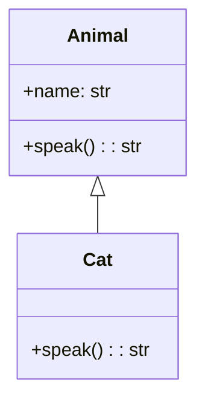
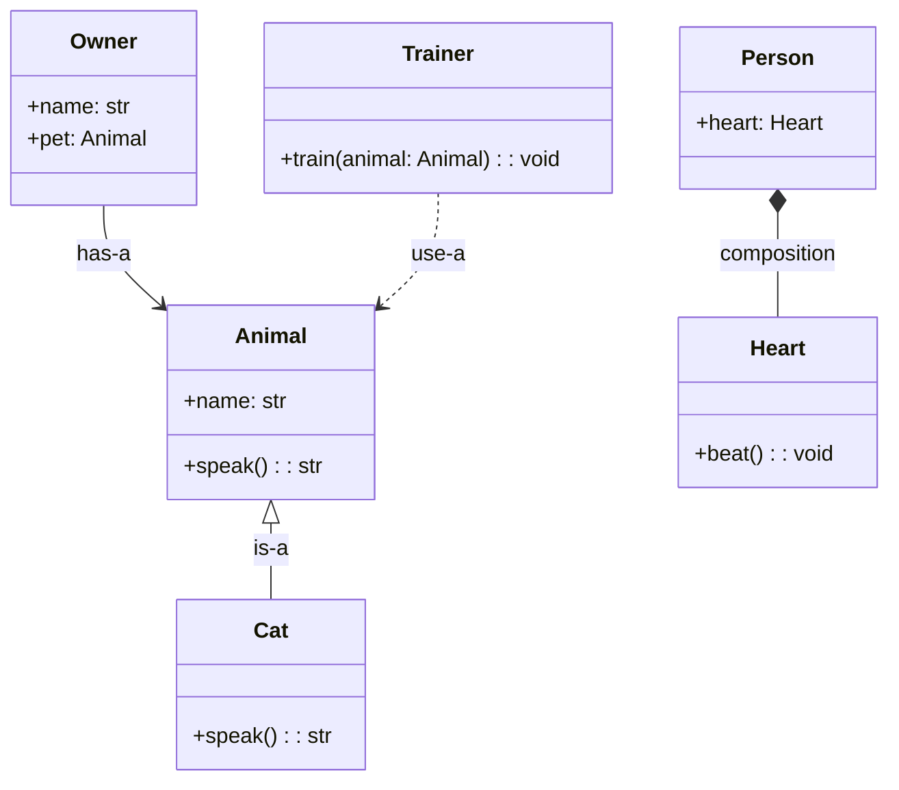
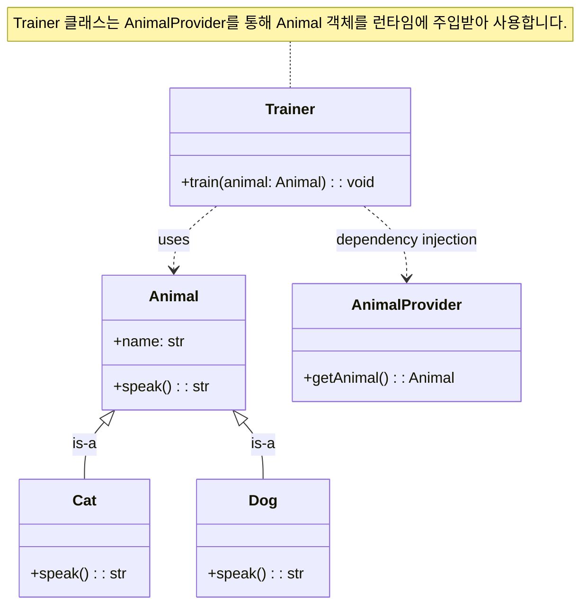

# mermaidjs
mermaidjs


# class Diagram







# 설명 
Animal Class 와 Cat class 의 관계는 Cat Class 는  Animal Class 를 상속 받습니다. 코드로 표현하세요
ChatGPT의 말:
ChatGPT
아래는 Python으로 Animal 클래스와 Cat 클래스의 관계를 상속을 통해 구현한 코드 예제입니다:

```python
class Animal:
    def __init__(self, name):
        self.name = name

    def speak(self):
        return f"{self.name} makes a sound."

class Cat(Animal):
    def speak(self):
        return f"{self.name} meows."

# 사용 예시
generic_animal = Animal("Generic Animal")
print(generic_animal.speak())  # Output: Generic Animal makes a sound.

cat = Cat("Kitty")
print(cat.speak())  # Output: Kitty meows.
```
설명
Animal 클래스:

동물의 일반적인 특성을 정의합니다.
speak 메서드는 일반 동물이 소리를 내는 행동을 표현합니다.
Cat 클래스:

Animal 클래스를 상속받습니다.
고양이 특유의 speak 메서드를 재정의(overriding)하여 고양이의 울음소리를 표현합니다.
이 코드는 Cat 클래스가 Animal 클래스를 상속받아 Animal의 기본 특성을 공유하지만, 고유한 행동(speak 메서드)을 추가로 정의할 수 있음을 보여줍니다.


나의 말:
이 관계를 mermaid 다이어그램으로 표시하세요
ChatGPT의 말:
ChatGPT
아래는 Animal 클래스와 Cat 클래스의 상속 관계를 Mermaid 다이어그램으로 표현한 코드입니다:


설명:
Animal 클래스:

name 속성과 speak 메서드를 정의.
+ 기호는 public 멤버를 의미.
Cat 클래스:

Animal 클래스를 상속받으며, speak 메서드를 재정의.
상속 관계:

Animal <|-- Cat는 Cat 클래스가 Animal 클래스를 상속받는 관계를 나타냅니다.
위 코드는 Mermaid 다이어그램으로 렌더링하면 클래스 상속 구조를 시각적으로 확인할 수 있습니다.


나의 말:
canvas 로 보여주세요
ChatGPT의 말:
ChatGPT
Animal Cat Mermaid Diagram
위 다이어그램은 Animal 클래스와 Cat 클래스의 상속 관계를 시각적으로 표현한 Mermaid 다이어그램입니다. 추가적인 편집이나 설명이 필요하시면 말씀해주세요!


나의 말:
화살표의 방향은 어떻게 결정 되나요? 
상속은 참조 나 종속성과는 어떤 관계인가요?
ChatGPT의 말:
ChatGPT
화살표의 방향은 클래스 간의 관계를 나타내며, 주로 클래스 다이어그램에서 상속과 같은 객체 지향 개념을 표현할 때 사용됩니다.

화살표의 방향 결정:

Animal <|-- Cat에서 화살표의 머리가 부모 클래스(상위 클래스)를 가리키고 있습니다. 즉, Cat 클래스가 Animal 클래스를 상속한다는 의미입니다.
Animal은 **상위 클래스(부모 클래스)**이고, Cat은 **하위 클래스(자식 클래스)**입니다. 따라서 상속 관계에서 화살표의 방향은 자식 클래스에서 부모 클래스를 가리키도록 표현합니다.
상속과 참조, 종속성의 관계:

상속은 특정 클래스가 다른 클래스의 속성과 메서드를 물려받아 사용할 수 있는 관계입니다. 이는 is-a 관계로 설명할 수 있습니다. 예를 들어, Cat은 Animal의 한 종류입니다.
참조는 한 클래스가 다른 클래스의 인스턴스를 속성으로 가질 때 나타납니다. 이를 has-a 관계라고 합니다. 예를 들어, Car 클래스가 Engine 클래스를 속성으로 참조한다면 Car는 Engine을 가진다고 말할 수 있습니다.
**종속성(Dependency)**은 한 클래스가 다른 클래스의 메서드를 사용하거나 인스턴스를 생성할 때 발생합니다. 이는 일시적인 의존 관계를 의미하며, 보통 uses-a 관계로 설명됩니다.
따라서 상속과 참조는 서로 다른 개념입니다. 상속은 두 클래스 간의 구조적 관계를 나타내며, 재사용성을 높이는 목적으로 사용됩니다. 참조와 종속성은 클래스 간의 동작 및 데이터 관리 방식을 나타냅니다.


나의 말:
is a , has a, use a 관계를 mermaid 로 나타내세요
ChatGPT의 말:
ChatGPT
1번 편집함
Mermaid 다이어그램을 업데이트하여 is-a, has-a, use-a 관계를 표현했습니다. 추가적인 설명이나 다른 관계 표현이 필요하시면 말씀해주세요!


나의 말:
점선, 실선, 화살표의 비움 채움, 등 UML 규칙에 대해서 알려 주세요
ChatGPT의 말:
ChatGPT
UML 다이어그램에서는 다양한 선과 화살표 유형을 사용하여 클래스 간의 관계를 표현합니다. 각 유형은 특정한 의미를 가지며, 관계의 특성을 나타냅니다. 아래는 주요 UML 관계와 해당 선의 형식을 설명합니다.

1. 일반화(Generalization) 관계 (is-a)
화살표 모양: 속이 빈 삼각형 화살표.
선의 종류: 실선.
의미: 상속 관계를 나타내며, "A는 B이다" (is-a)의 관계를 표현합니다.
예시: Animal <|-- Cat
여기서 Cat은 Animal의 자식 클래스입니다.
2. 집합(Aggregation) 관계 (has-a)
화살표 모양: 속이 빈 마름모 화살표.
선의 종류: 실선.
의미: 약한 집합 관계를 나타내며, "A는 B를 가진다" (has-a)를 나타냅니다. 구성 요소가 다른 객체에 포함되지만, 서로 독립적입니다.
3. 복합(Composition) 관계 (strong has-a)
화살표 모양: 속이 채워진 마름모 화살표.
선의 종류: 실선.
의미: 강한 집합 관계로, 객체가 전체-부분 관계에 있으며 생명 주기를 공유합니다. 한 객체가 파괴되면 구성 요소도 함께 파괴됩니다.
4. 의존(Dependency) 관계 (use-a)
화살표 모양: 속이 빈 화살표.
선의 종류: 점선.
의미: 의존 관계를 나타내며, "A는 B를 사용한다" (use-a)를 나타냅니다. 주로 메서드에서 다른 클래스를 일시적으로 사용할 때 표현됩니다.
예시: Trainer ..> Animal : use-a
여기서 Trainer 클래스는 Animal 객체를 사용하지만 직접 소유하거나 지속적으로 참조하지 않습니다.
5. 연관(Association) 관계
화살표 모양: 비어 있거나 없음.
선의 종류: 실선.
의미: 일반적인 연관 관계를 나타냅니다. 클래스 간의 연관성을 의미하며, 객체가 서로 연결된 것을 표현합니다.
예시: Owner --> Animal : has-a
여기서 Owner는 Animal을 소유하고 있는 약한 연관 관계입니다.
정리
실선: 주로 상속, 집합, 복합, 연관 관계에 사용됩니다.
점선: 의존 관계를 표현합니다.
속이 빈/채워진 화살표: 일반화(상속) 또는 의존 관계를 표현하며, 삼각형/마름모 모양은 관계의 종류(상속, 집합, 복합)를 명확히 구분합니다.
이 규칙들을 이해하면 UML을 통해 객체 간의 관계를 명확히 시각화하고 설계의 의도를 효과적으로 전달할 수 있습니다.


나의 말:
이 관계를 나타내는 예제를 mermaid 로 작성하고 설명을 추가하세요
ChatGPT의 말:
ChatGPT
1번 편집함
Mermaid 다이어그램을 업데이트하여 is-a, has-a, use-a, composition 관계를 추가했습니다.

설명:
Animal <|-- Cat : is-a: Cat은 Animal을 상속받는 상속 관계입니다. (is-a 관계)
Owner --> Animal : has-a: Owner 클래스는 Animal을 소유하는 약한 연관 관계를 나타냅니다. (has-a 관계)
Trainer ..> Animal : use-a: Trainer 클래스는 Animal을 일시적으로 사용하는 의존 관계입니다. (use-a 관계)
Person *-- Heart : composition: Person 클래스는 Heart를 구성 요소로 가지며, 생명 주기를 공유하는 복합 관계를 나타냅니다. (composition 관계)
더 수정이 필요하거나 추가적인 설명이 필요하시면 알려주세요!


나의 말:
class diagrma 은 컴파일시 결정되는 구조 입니다. 
runtime 시 결정되는 의존성 역전 같은 구조는 mermaid 로 어떻게 표현 하나요?
ChatGPT의 말:
ChatGPT
런타임 시 결정되는 구조, 특히 **의존성 역전 원칙(DIP)**과 같은 패턴은 일반적으로 객체 간의 동적 관계를 다룹니다. 이러한 의존성을 표현하기 위해 런타임 인터페이스 또는 의존성 주입과 관련된 다이어그램을 사용할 수 있습니다. Mermaid 다이어그램에서 이를 나타내는 방법 중 하나는 인터페이스와 의존 주입을 표현하는 것입니다.

아래는 이를 반영한 예제입니다:


설명:

1.Animal <|-- Cat : is-a 및 Animal <|-- Dog : is-a:
* Cat과 Dog는 Animal의 자식 클래스입니다.
 
1.의존성 주입 (Dependency Injection):
* Trainer ..> AnimalProvider : dependency injection은 Trainer 클래스가 런타임에 Animal 객체를 주입받는 구조를 나타냅니다.
* AnimalProvider는 Trainer에게 Animal 객체를 제공합니다.이는 런타임 의존성 역전을 표현합니다. 즉, Trainer는 Animal의 구체적인 구현(Cat, Dog)을 알 필요가 없습니다.

1.런타임 의존성:
* Trainer 클래스는 Animal의 구체적인 인스턴스를 의존 주입을 통해 받습니다. 이를 통해 구현체에 대한 의존성을 인터페이스 또는 추상화로 전환함으로써 유연성을 확보할 수 있습니다.


런타임 의존성 주입과 의존성 역전 원칙을 시각화하는 데 있어, 인터페이스와 구체적인 구현 사이의 관계를 점선으로 연결하고, 제공자 클래스를 통해 주입하는 방식으로 표현합니다. 이 구조는 런타임에 어떤 구체 클래스가 사용될지 결정되도록 설계된 것을 나타냅니다.
